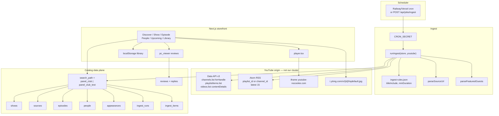
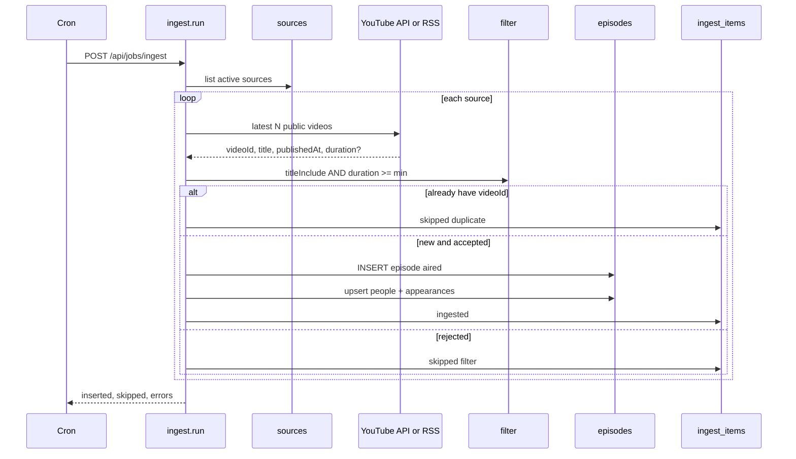

# Panel Club platform

Catalog JSON and a human editing git on every upload cannot be the production system. Netflix does not ship a new binary when a title lands; it writes metadata to a catalog service and leaves bytes on a CDN. We do the same shape with a different tape: **YouTube is the CDN and the player. Postgres (Neon) is the catalog. Next.js is the storefront.**

This is not a restreamer. We never download, transcode, or proxy video. Playback is the official `youtube-nocookie.com` iframe. Thumbs stay `i.ytimg.com`. Ingest uses the [YouTube Data API v3](https://developers.google.com/youtube/v3) (API key, quota) and, when the key is absent, the public Atom feeds YouTube already publishes for playlists and channel IDs. We do not scrape watch pages or bypass player protections.

## Netflix mapping

| Netflix layer | Panel Club | Why it is smaller |
| --- | --- | --- |
| Content acquisition | Ingest worker polling a **source registry** (playlist or channel) | One-time bind of show → YouTube source; after that, no human |
| Encoding | YouTube | They already have the file |
| Open Connect CDN | `youtube-nocookie.com` + `i.ytimg.com` | Embed + poster, not our edges |
| Metadata / catalog | Postgres schemas `panel_club` / `panel_club_test` | Same DDL, isolated data |
| Playback license / DRM | YouTube embed policy | Dead embed → Open on YouTube |
| Identity | `pc_viewer` cookie | No accounts in this version |
| Continues / my list | `localStorage` | Device-local, unchanged |
| Studio | Source rows + ingest audit | Not a public CMS |

The only operator work that cannot be automated is **creating a show and pointing it at a playlist or channel** (and an optional title filter when the channel uploads more than that show). Credits on new episodes are parsed from titles (`ft.` / `feat.`) the same way the seed catalog already encodes guests. Empty parse → episode still publishes; People pages stay correct for hosts, guests appear when the title carries them.

## Environments and schemas

One database cluster, two Postgres schemas, identical tables:

| Env | `CATALOG_SCHEMA` | `NODE_ENV` | Data |
| --- | --- | --- | --- |
| Unit tests | n/a | test | `node:sqlite` `:memory:` |
| Local / CI integration | `panel_club_test` | development / test | Neon branch or local Postgres |
| Production | `panel_club` | production | Neon primary |

SQLite locally uses a file (`data/panel-club-catalog.sqlite`) because the Next process already runs Node 22. Tests never open that file. Production must not read `content/catalog.json` after cutover; JSON is **seed only**.

## Directory (target)

```text
docs/design/platform/     architecture, this file
docs/sql/                 Postgres DDL (search_path = CATALOG_SCHEMA)
content/catalog.json      seed snapshot only
content/ingest-rules.json per-show title/duration gates

src/app/                  storefront (RSC + client islands)
src/components/           UI
src/lib/                  existing read helpers (catalog types, reviews, people-view)

src/platform/
  schema.ts               schema name + sqlite vs postgres switch
  catalog-db.ts           open/seed/read Catalog from the store
  youtube/
    source-url.ts         playlist vs @handle vs channel id
    duration.ts           ISO-8601 → seconds
    title-credits.ts      ft./feat. → guest string
    client.ts             Data API + Atom RSS (injected fetch)
  ingest/
    run.ts                poll → filter → upsert → audit
    cli.ts                node --experimental-strip-types …
    types.ts

src/app/api/jobs/ingest/  POST, Bearer CRON_SECRET
```

Frontend stays App Router. Backend for visitors is server components querying the catalog store. Backend for the clock is the ingest job. Streaming is embed-only.

## Low-level components



## Ingest sequence (one show, no human)



Channel sources that are not a curated playlist **must** have `title_include` (example: Samay’s channel vs “LATENT”). Playlist sources are already the show; duration still drops Shorts.

Handle → uploads playlist:

1. `GET .../channels?part=contentDetails&forHandle=@Handle&key=`
2. `relatedPlaylists.uploads`
3. `playlistItems.list?playlistId=UU…&maxResults=15&part=snippet,contentDetails`
4. `videos.list?id=…&part=contentDetails` for ISO duration

Without an API key, playlist and `UC…` channel IDs use RSS. `@handle` cannot be resolved without the API (or a stored `channel_id`). Seed stores whatever `sourceUrl` already has; resolve handles once, persist `channel_id`, then RSS works.

## Tables

```text
shows          id, slug, name, host, category, description, cover_video_id,
               source_url, checked_at, availability_note
sources        show_id, kind (playlist|channel), playlist_id, channel_id, handle,
               title_include, min_duration_seconds, active
episodes       video_id PK, show_id, title, guest, duration_seconds, status,
               premieres_at, media_url, published_at
people         slug PK, name
appearances    episode_id, person_slug, role (host|guest)  UNIQUE
ingest_runs    id, started_at, finished_at, inserted, skipped, errors
ingest_items   run_id, video_id, show_id, status, detail
reviews        existing cookie model, same database in production
```

## Traffic after cutover

```text
Visitor → Next RSC → SELECT catalog (schema panel_club)
                    → iframe / thumb on YouTube
                    → POST review → same DB, reviews table
Cron    → Next route → YouTube list → INSERT episodes (idempotent on video_id)
```

Git is code. Neon is data. YouTube is tape.
