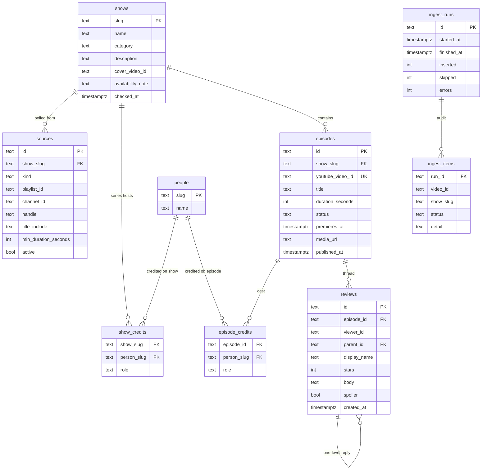

# Catalog database

Locked data model for Panel Club. Two Postgres schemas, identical DDL: `panel_club` (production) and `panel_club_test` (local/CI). Unit tests use sqlite `:memory:` with the same table names. JSON `content/catalog.json` is seed only.

Not a Netflix warehouse. No seasons table, no asset encode tables, no users. YouTube holds the file. We hold **which show an upload belongs to, who sat on it, and what viewers wrote**.

## What is not a table

| Thing | Where it lives | Why |
| --- | --- | --- |
| Viewer account / password | nowhere | No accounts |
| `pc_viewer` cookie | HTTP cookie | Opaque `viewer_id` string on reviews |
| Continue / watchlist / history | `localStorage` | Device-local by lock |
| Review IP rate limit | process memory | One replica |
| Category list | `CHECK` on `shows.category` | Four values, not a taxonomy product |
| Season / episode number | inside `episodes.title` | Seed does not have structured S/E |
| Video bytes, thumbs, DRM | YouTube | Embed + `i.ytimg.com` |
| Ingest title rules file | columns on `sources` | `ingest-rules.json` is seed for those columns |

## Count: 9 tables

```text
shows
  1─n  sources
  1─n  show_credits     → people
  1─n  episodes
         1─n  episode_credits  → people
         1─n  reviews          (self: parent_id)

ingest_runs
  1─n  ingest_items
```

1 `shows` · 2 `sources` · 3 `episodes` · 4 `people` · 5 `show_credits` · 6 `episode_credits` · 7 `reviews` · 8 `ingest_runs` · 9 `ingest_items`.

`people` is shared by both credit tables. `reviews` hang off `episodes`, not shows.

## ERD



## Relations, decided

**Show → episodes.** One show, many episodes. `episodes.show_slug` is required. An episode never belongs to two shows. `youtube_video_id` is unique when present so ingest is idempotent.

**Episode identity vs YouTube id.** PK is `episodes.id`, not the YouTube id. Aired rows set `id = youtube_video_id` so existing `/shows/{slug}/episodes/{videoId}` URLs stay valid. Upcoming rows may have `youtube_video_id` NULL until the upload exists; they get a generated `id`.

**Show → sources.** One show, **many** sources. Today each show has one playlist or one channel. A later season can be a second playlist without a second show row. `kind` is `playlist` | `channel`. Channel sources **must** have `title_include` (enforced in ingest, not only in JSON).

**People.** `people.slug` is `slugFromName(name)`. Created when first credited. No photos, no bios.

**Show credits vs episode credits.** Hosts of the series live on the **show**, not copied onto every episode string.

- `show_credits.role` = `host` (co-hosts are two rows, not `"A & B"`).
- `episode_credits.role` = `guest` normally; `host` only if that person hosted that episode and is not a series host.
- A person can be series host and also a guest on someone else’s show (two tables, or guest row on the other show’s episode).
- Primary key `(show_slug, person_slug, role)` and `(episode_id, person_slug, role)` so the same person can be listed as both host and guest on one episode if the product ever needs it (today People already allows hosted + guested).

**Do not store `shows.host` or `episodes.guest` as source of truth.** Those strings are a seed parse. Public UI joins credits. (A generated view can concatenate for cards if needed.)

**Cover.** `shows.cover_video_id` is a YouTube id used for posters. It is **not** a FK to `episodes` (the cover can outlive a taken-down episode, which already happens for Latent S1). Player still uses the episode’s own `youtube_video_id`.

**Reviews.** One table, adjacency list. `parent_id` NULL = root. Unique `(episode_id, viewer_id) WHERE parent_id IS NULL`. Replies: `parent_id` → `reviews.id`, same `episode_id` as parent, no `stars`, max 3 per viewer per episode (app rule). `ON DELETE CASCADE` from episode. `ON DELETE CASCADE` from parent review. No `viewers` table.

**Ingest audit.** `ingest_runs` is one cron tick. `ingest_items` is per video considered (`ingested` | `skipped` | `error`). No FK from items to episodes: a skip has no episode row.

**Library.** Not in this database until there are accounts.

## Constraints (the ones that matter)

```text
shows.category ∈ {Panel shows, Game shows, Roasts, Advice & banter}
episodes.status ∈ {aired, upcoming}
aired ⇒ youtube_video_id IS NOT NULL
upcoming may have null youtube_video_id
sources.kind ∈ {playlist, channel}
playlist ⇒ playlist_id IS NOT NULL
channel ⇒ channel_id IS NOT NULL OR handle IS NOT NULL
credits.role ∈ {host, guest}
reviews.stars NULL on replies; 1–5 on roots
reviews.parent_id is either NULL or a root (app rejects reply-to-reply)
```

## Read paths (what each screen joins)

| Screen | Query |
| --- | --- |
| Discover | `shows` + count aired episodes + avg root `reviews.stars` + cover id |
| Show | `shows` + `show_credits` → people + `episodes` ordered by `published_at` |
| Episode | `episodes` + show + `episode_credits` ∪ series hosts + `reviews` thread |
| People list | `people` |
| Person | `show_credits` ⨝ `episodes` (hosted) UNION `episode_credits` guests |
| Upcoming | `episodes` WHERE status = upcoming ORDER BY premieres_at |
| Ingest | `sources` WHERE active; insert episode + credits |

## Environments

```text
SET search_path TO panel_club;       -- production
SET search_path TO panel_club_test;  -- integration
sqlite :memory:                      -- unit tests
```

One Neon database, two schemas. Never mix rows.

## Deliberately later

- `seasons`
- `users` / `viewers`
- `library_entries`
- `media_assets` / HLS
- category table
- full-text search engine
