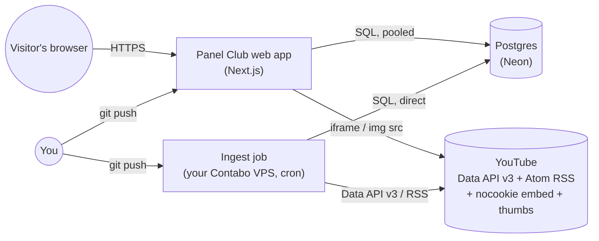
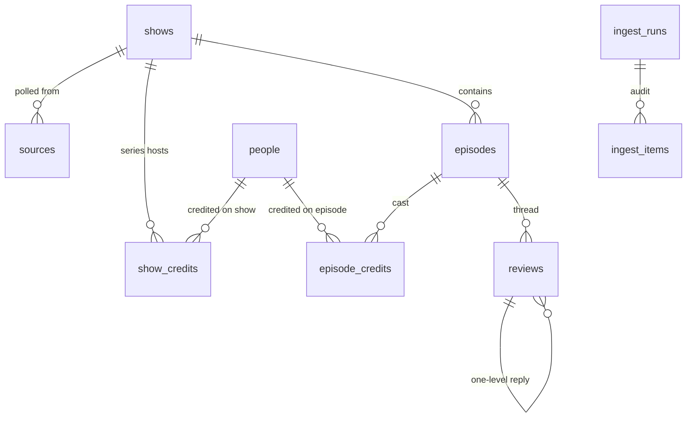
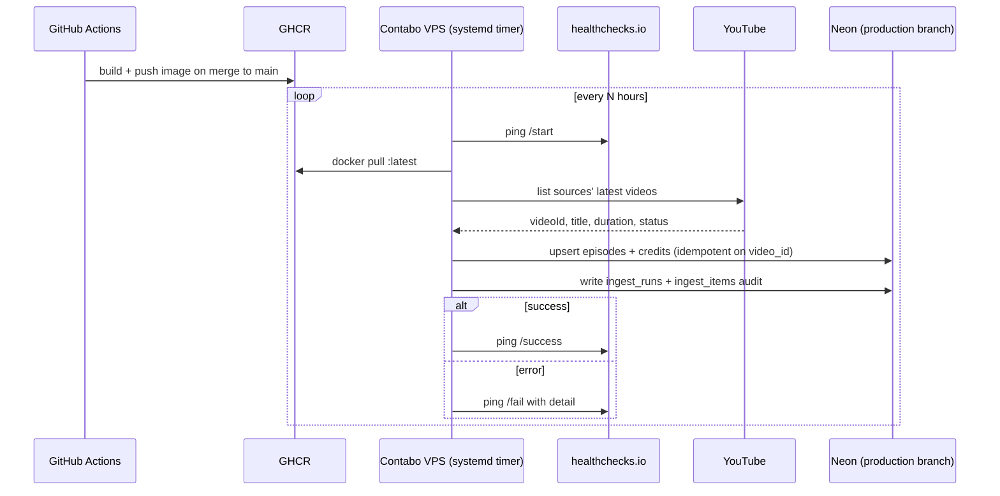

# Panel Club — ground-up architecture (v2)

Written fresh, as if the product did not exist yet. Where the existing `docs/design/` and
`docs/ideas/` files already reasoned well about something (the data model, "no accounts",
"YouTube is the tape"), this doc keeps that conclusion and says why, instead of re-litigating it.
Where the existing code contradicted its own locked decisions (dual sqlite/Postgres paths,
an unlocked hosting decision, a rate limiter that can't survive serverless), this doc replaces
them outright.

Coding is explicitly out of scope for this document. This is the thing you hand to whoever
writes the code (you, an agent, both) so they don't have to make architecture decisions
mid-implementation.

**Decisions confirmed, resolving prior ambiguity:**
- Repo of record is **`laraib-labs/panel-club`** (the `ingest-vps.md` naming, not the older
  `laraib-sidd/panel-club` reference in `free-host.md` — that doc is now superseded on this
  point). GHCR images, repo secrets, and Vercel's GitHub connection all point here.
- **No data migration.** Cut over clean: reseed Neon `production` from `content/catalog.json`,
  do not carry over whatever reviews exist on the current Railway sqlite volume. This is a
  genuine rebuild, not a live migration.
- **Docker is already installed on the Contabo VPS** — wave 4 (ingest) needs no VPS bootstrap
  step.

---

## 1. Problem statement

A public website that catalogs Indian comedy panel/game shows published on YouTube, lets a
visitor browse/search/play them without signing in, and lets that visitor leave a lightweight
review. New episodes should appear on the site automatically, same day they're uploaded,
with zero manual editing of the site.

## 2. Requirements

### Functional
- Browse: Discover grid, per-show page, per-episode page, People directory + search, Upcoming.
- Play: embed the official YouTube player. Never host, transcode, or proxy video.
- Review: 1–5 stars + text per episode, one level of replies, no login.
- Personal library (continue watching / watchlist / history): device-local, no login.
- Catalog freshness: new YouTube uploads become site content without a deploy.

### Non-functional (the part the previous pass got wrong in practice)
- **$0/month at hobby traffic.** No card charged for app compute or DB while traffic stays low.
- **One source of truth per concern.** Not sqlite-and-Postgres for the same table.
- **A merge that breaks the build cannot reach production.** (`next build` currently fails on
  `main` today — this is the single most important non-functional requirement to fix.)
- **Rate limiting and any shared secret must work under the real deployment topology** — i.e.
  not an in-process `Map` if the app runs as multiple stateless serverless instances.
- **Idempotent ingest.** Safe to re-run, safe to retry, safe to run twice for the same video.
- **Observable failure.** If the nightly ingest silently stops running, you find out without
  having to notice the site looks stale.

## 3. System context



Two independent deploy targets, one shared database, no direct network path between the
web app and the VPS. The web app never triggers ingest; ingest never serves traffic.

## 4. Hosting & compute — decision

**Vercel Hobby (app) + Neon Free (database) + your existing Contabo VPS (ingest cron).**

Why, against the realistic alternatives for a Next.js app with a Postgres backend:

| Option | Cost | Verdict |
|---|---|---|
| **Vercel Hobby** | $0, personal/non-commercial use | **Chosen.** Next.js's own platform — App Router, Server Actions, `cookies()`/`headers()`, preview deployments per PR, all work with zero adaptation. A PR preview build **is a free CI gate**: it runs `next build` (type-check included) before anything reaches `main`, which alone would have caught the build-breaking bug found in review. |
| Railway (current) | Free trial only, then paid | Works today, but you already flagged wanting a free steady state, and the trial is what triggered `free-host.md` in the first place. |
| Render free web | $0 | Free instances sleep after 15 min idle → cold-start tax on every quiet visit, worse than Vercel for a low-traffic site. |
| Cloudflare Pages | $0 | Viable (Neon has an HTTP driver for Workers), but Next.js SSR/Server Actions support there has more edge cases than Vercel's native support. Revisit only if Vercel's limits ever bind. |
| Fly.io / a second VPS | ~$0–low | No standing free compute tier worth relying on; you'd be running a Node process yourself for no benefit over Vercel doing it for free. |

**Database: Neon Free tier**, one project, **separate branches for `production` and
`development`/`test`** (see §6 — this replaces the current single-project two-schema hack).
Neon's serverless Postgres scale-to-zero fits a low-traffic site: first request after idle
waits a moment on the DB, not on the app.

**Ingest: stays on your Contabo VPS**, because you already run a cron-capable box and the
job has no reason to touch the public app. See §7 for how it's built and deployed —
"industry standard" here means containerized, versioned, and monitored, not a raw script.

Total steady-state cost: **$0/month for app + DB**, VPS cost is sunk (you already pay for it
for other pers jobs).

## 5. Component breakdown

| # | Component | Responsibility | Tech | Runs where |
|---|---|---|---|---|
| 1 | **Storefront** | Render Discover/Show/Episode/People/Upcoming, accept review/reply submissions | Next.js 15 App Router, React 19, Server Actions, TypeScript strict | Vercel (Node.js serverless runtime — not Edge, because `pg` needs raw TCP) |
| 2 | **Catalog + reviews store** | Single source of truth for shows/episodes/people/credits/reviews/ingest audit | Postgres (Neon), `pg` driver, pooled connection for the app | Neon |
| 3 | **Rate limiter** | Per-IP throttle for review/reply submissions, survives multiple serverless instances | Upstash Redis (free tier) + `@upstash/ratelimit` | Upstash (serverless, HTTP-based, no connection pool to manage) |
| 4 | **Ingest job** | Poll YouTube sources on a schedule, upsert episodes/people/credits, write an audit trail | Node 22, same TypeScript codebase as the app (shared `platform/` package), Postgres direct (non-pooled) connection | Docker container on the VPS, `systemd` timer |
| 5 | **CI (app)** | Block a merge/deploy that fails lint, typecheck, test, or build | GitHub Actions (lint/typecheck/unit tests) + Vercel's own preview-deploy build (`next build`) | GitHub Actions + Vercel |
| 6 | **CI/CD (ingest)** | Build, version, and ship the ingest job to the VPS without hand-editing files on the box | GitHub Actions → build Docker image → push to GHCR (free) → VPS pulls tagged image | GitHub Actions + GHCR + VPS |
| 7 | **Observability** | Know when ingest stops running or the app errors, without checking manually | healthchecks.io free tier (cron heartbeat, ping on start/success/fail) + Vercel's built-in function logs; Sentry free tier optional for app exceptions | External SaaS, free tiers |
| 8 | **Secrets** | Keep `DATABASE_URL`, `YOUTUBE_API_KEY`, Upstash token, GHCR credentials out of git | Vercel Environment Variables (app secrets) · VPS root-owned `EnvironmentFile` (ingest secrets, unchanged from today) · GitHub Actions repo secrets (CI/CD credentials, repo-scoped not org-scoped — matches your existing `ingest-vps.md` decision) | n/a |

## 6. Data model

The existing 9-table design (`docs/design/platform/schema.md`) is genuinely sound —
adjacency-list reviews, `people` shared across show/episode credits, an ingest audit trail
separate from the content tables. Kept as-is, with one structural change:

**Drop the `CATALOG_SCHEMA` env-var + `SET search_path` mechanism entirely.** Today, which
environment you write to is decided by a mutable runtime setting (`assertSafeSchemaName` +
string-interpolated `SET search_path`) — a single wrong or missing env var silently points
you at the wrong data. Replace it with **two separate Neon branches** (`production`,
`development`), each with its own `DATABASE_URL`. Environment isolation becomes a property of
*which connection string you have*, not of *what SQL ran after connecting*. This deletes
`assertSafeSchemaName`, the dynamic `SET search_path` query, and the whole class of bug where
schema selection logic has a typo.

Unit tests still use `node:sqlite :memory:` for pure-function/logic tests that don't need a
real Postgres (fast, zero setup). Integration tests that exercise actual SQL run against the
`development` Neon branch (or a local Postgres via a GitHub Actions service container) —
**not** a second sqlite schema pretending to be Postgres, since the current dual-implementation
(`saveReview` vs `saveReviewPg`, duplicated line-for-line) is exactly the maintenance cost
you're trying to eliminate by going Postgres-only.



(Full column-level definitions: reuse `docs/design/platform/schema.md` verbatim — it doesn't
need to change.)

## 7. Ingest job — "industry standard" deploy to the VPS

Today's version is a bare `node --experimental-strip-types` script invoked by a systemd timer.
That's fine as a scheduler, but the *deploy* of the job onto the VPS was manual (clone repo,
hope Node 22 is installed, hope nothing drifted). Concretely:

1. **Containerize** the ingest job (small multi-stage Dockerfile: build the TS, run on
   `node:22-slim`). This pins the Node version and all dependencies — no more "warning:
   `/usr/bin/node` is not v22.x" checks in a shell script.
2. **CI builds and publishes the image**: on merge to `main` (path-filtered to
   `src/platform/**`), a GitHub Actions workflow builds the image and pushes it to **GHCR**
   (`ghcr.io/laraib-labs/panel-club-ingest:<git-sha>` and a moving `:latest` tag) — free for a
   personal repo.
3. **The VPS only pulls and runs**, it never builds. The `systemd` timer becomes:
   `docker pull ghcr.io/.../panel-club-ingest:latest && docker run --rm --env-file /etc/panel-club.env ...`.
   Rollback is "run the previous tag," not "git revert and hope."
4. **Secrets stay exactly where your `ingest-vps.md` decision already put them**: root-only
   `/etc/panel-club.env` (600) on the VPS holds `DATABASE_URL` + `YOUTUBE_API_KEY`;
   `YOUTUBE_API_KEY` is also a **repository** secret (not org) for CI; `DATABASE_URL` never
   touches GitHub. GHCR push needs a repo-scoped `GITHUB_TOKEN` (automatic) and the VPS needs a
   read-only PAT or GHCR credential — also repo-scoped.
5. **Retry + backoff** on YouTube Data API calls (currently a bare `fetch`, no retry at all) —
   treat quota/5xx as retryable, treat "channel has no uploads playlist" etc. as a permanent
   per-source error recorded in `ingest_items`, not a crash of the whole run.
6. **Heartbeat**: the job pings healthchecks.io at start, and again on success or failure, with
   the failure detail attached. You get an email/webhook if a run errors *or* if the timer
   simply stops firing (missed-ping alerting) — the second case is the one that bites you
   silently today.



## 8. Review submission — fixing the two concrete security/reliability bugs

```mermaid
sequenceDiagram
  participant B as Browser
  participant SA as Server Action (Vercel, Node runtime)
  participant RL as Upstash Redis
  participant DB as Neon (production branch)

  B->>SA: submit review (form POST)
  SA->>SA: read client IP from Vercel's trusted request context (not raw X-Forwarded-For[0])
  SA->>RL: INCR ip-bucket, check limit (atomic, shared across all instances)
  alt over limit
    RL-->>SA: rejected
    SA-->>B: silent return (form looks unchanged; nothing saved)
  else allowed
    SA->>DB: upsert review (parameterized, unchanged logic)
    DB-->>SA: ok
    SA-->>B: revalidate page
  end
```

Two changes from today's implementation:
- **Trust the platform's client-IP, not the first hop of a client-suppliable header.** On
  Vercel, use the request's resolved IP (Vercel's edge sets this correctly; if reading from
  `headers()`, use the *last* trusted hop or Vercel's dedicated IP header — never the
  attacker-controlled first element of a raw `X-Forwarded-For`, which is what lets the current
  rate limiter be bypassed for free).
- **Move rate-limit state out of process memory.** An in-memory `Map` cannot work correctly
  once the app is more than one serverless instance — each cold start gets a fresh, empty map,
  so the "5 per minute" cap silently resets constantly in production. Upstash's free tier
  (10k commands/day, atomic `INCR`+TTL) is the standard fix for exactly this problem and costs
  nothing at this traffic level.

The `pc_viewer` cookie identity model (unsigned, one review per browser, replaceable) stays —
it's a soft cap by design (your own `comedy-ux.md` decision already accepted this tradeoff
explicitly), and IP rate limiting is the real backstop.

## 9. Engineering principles → concrete mechanism

| Principle | Mechanism |
|---|---|
| A broken build can't ship | Vercel preview deploy (`next build`, type-checked) required-green on every PR; GitHub Actions runs `tsc --noEmit` + full `node --test` suite as a second, faster gate |
| One source of truth | Postgres-only, everywhere, no sqlite production path (§6) |
| Idempotency | Ingest upserts on `episodes.youtube_video_id` unique constraint (already correct — keep it) |
| Least privilege | Repo-scoped GitHub secrets only, no org secrets (matches your existing decision); VPS env file root:600 |
| Defense in depth on secrets | Constant-time comparison (`crypto.timingSafeEqual`) for any shared-secret check — moot once the HTTP `/api/jobs/ingest` route is deleted (§10), but apply the same standard to any future shared secret |
| Observable failure | healthchecks.io heartbeat with missed-ping alerting (§7); Vercel logs + optional Sentry for the app |
| Environment isolation by construction | Separate `DATABASE_URL` per Neon branch, not a runtime schema switch (§6) |
| Connection hygiene | App uses Neon's **pooled** connection string (many short-lived serverless invocations); ingest job uses the **direct** (unpooled) connection string (one long-running batch transaction) — this distinction already existed as a comment in `catalog-ingest-pg.ts`; make it a documented, enforced convention, not tribal knowledge in a code comment |
| Testing pyramid | Fast unit tests on pure logic (`node:sqlite :memory:` fine here — no Postgres needed for e.g. duration parsing, credit parsing, filters); integration tests against a real Postgres branch for anything that touches SQL; no more "sqlite mirrors Postgres and we hope the semantics match" |
| Fail loud, not silent | Ingest and CI fail visibly. Review rate-limit stays a silent no-op by product choice. |

## 10. What gets deleted, not just added

- `src/lib/reviews-db.ts`'s sqlite path, `saveReview`/`listReviews`/`averageScore` (sqlite
  variants) in `reviews.ts` — keep only the `*Pg` functions, rename them without the suffix.
- `src/platform/catalog-db.ts`'s sqlite-specific catalog path and `content/catalog.json` as a
  *runtime* read path — it becomes a one-time seed migration, exactly as `neon-backend.md`
  already decided and never finished.
- `src/app/api/jobs/ingest/route.ts` and `CRON_SECRET` — superseded by the VPS-only ingest path
  (§7); an HTTP-triggered ingest endpoint on the public app is attack surface with no user.
- `assertSafeSchemaName` / dynamic `SET search_path` in `src/platform/pg.ts` — superseded by
  per-environment `DATABASE_URL`s (§6).
- The in-memory `review-rate-limit.ts` — superseded by Upstash (§8).

## 11. Explicitly not in this version

(Carried forward from your own prior decisions — still correct.)
- Accounts / login of any kind.
- An admin CMS or operator UI — adding a show/source is still a manual DB row today; automate
  only if that friction actually shows up.
- Video hosting, transcoding, or restreaming — YouTube embed only, always.
- Full-text search, a `seasons` table, multi-tenancy.
- Visible rate-limit / rejected-review UI (over-limit stays a silent no-op).

## 12. Suggested build order (waves, not a schedule)

1. **Data plane**: Neon project + `production`/`development` branches, run the (unchanged)
   schema migrations, seed from `content/catalog.json` once, delete the schema-switch code.
2. **Storefront read paths**: point every page at Postgres-only helpers, delete the sqlite
   catalog path, confirm `next build` and the full test suite are green **in CI**, not just
   locally.
3. **Reviews + rate limiting**: wire Upstash, fix the client-IP trust bug, delete the
   in-memory limiter. Over-limit stays a silent no-op (no rate-limit UI).
4. **Ingest**: Dockerize, wire GHCR + the GitHub Actions build, point the VPS systemd timer at
   the image, add healthchecks.io pings and retry/backoff on the YouTube client, delete the
   HTTP ingest route.
5. **Hardening pass**: constant-time secret comparisons wherever one remains, Sentry (optional),
   a short runbook for "ingest alert fired, now what."

## 13. Open decisions still needing your call

- Domain name / custom domain on Vercel (not required for Hobby, but you may want one).
- Sentry or skip it — free tier is generous, but it's one more account to manage for a hobby
  project; Vercel's own function logs may be enough at this scale.
- Ingest schedule/frequency (how many hours between polls) — depends on how fast you want new
  episodes to appear vs. YouTube API quota usage.

---

## Locked decisions

Copied from `docs/ideas/ground-up-rebuild.md`. Do not reopen. Comedy-ux labels/nav stay in `docs/design/comedy-ux/spec.md`. Ingest secrets stay repo-scoped (`docs/ideas/ingest-vps.md`). This doc supersedes `docs/ideas/free-host.md` on hosting (that idea’s Decision was empty) and supersedes `neon-backend.md` on `CATALOG_SCHEMA` (two Neon branches, not two schemas).

- **Product:** Vercel Hobby storefront, Neon Free with `production`/`development` branches, Docker ingest on Contabo.
- **Success:** $0 app+DB; Postgres-only runtime; shared Upstash rate limit (silent reject); GHCR ingest + healthchecks.io; no sqlite production, no schema switch, no public ingest route.
- **Constraints:** `laraib-labs/panel-club`; no org secrets; `DATABASE_URL` never on GitHub; no Railway reviews migration; YouTube embed; no accounts/CMS; no new screens; sqlite `:memory:` only for unit logic tests.
- **Smallest version:** Drop `CATALOG_SCHEMA`; storefront Postgres + CI gate; Upstash + trusted IP, silent over-limit; ingest image + timer pull; delete HTTP ingest.
- **Not in this version:** Accounts, CMS, restream, search, seasons, multi-tenancy, custom domain, Sentry (still open in §13), rate-limit UI.

## Implementation slices (beads)

| Slice | Owns | Blocked by | Test |
| --- | --- | --- | --- |
| Data plane | `src/platform/pg.ts`, `src/platform/schema.ts`, `src/platform/migrate.ts`, `src/platform/migrate.test.ts`, `src/platform/seed.ts` | — | `node --experimental-strip-types --test src/platform/migrate.test.ts` |
| Storefront Postgres + CI | `src/lib/catalog.ts`, `src/app/page.tsx`, `src/app/shows/[slug]/page.tsx`, `src/app/upcoming/page.tsx`, `src/app/people/page.tsx`, `src/app/people/[slug]/page.tsx`, `src/app/library/page.tsx`, `.github/workflows/ci.yml` | Data plane | `npx tsc --noEmit` and `npx next build` (CI job must run both) |
| Reviews + Upstash | `src/lib/reviews.ts`, `src/lib/reviews-db.ts`, `src/lib/review-rate-limit.ts`, `src/lib/review-rate-limit.test.ts`, `src/app/shows/[slug]/episodes/[id]/page.tsx` | Storefront | `node --experimental-strip-types --test src/lib/review-rate-limit.test.ts src/lib/reviews.test.ts` |
| Ingest image | `Dockerfile`, `.github/workflows/ingest-image.yml`, `ops/panel-club-ingest.service`, `ops/panel-club-ingest.timer`, `ops/install-ingest-vps.sh`, `src/platform/youtube/client.ts`, `src/platform/ingest/cli.ts`, `src/app/api/jobs/ingest/route.ts` (delete) | Data plane | `test -f Dockerfile && grep -q ghcr.io ops/panel-club-ingest.service` |
| Hardening runbook | `docs/ops/ingest-runbook.md` | Reviews + ingest | `test -f docs/ops/ingest-runbook.md` |

Citations: [`@upstash/ratelimit` sliding window](https://upstash.com/docs/redis/sdks/ratelimit-ts/gettingstarted) — `Ratelimit.slidingWindow(5, "60 s")` + `Redis.fromEnv()` + `limit(ip)`. App stays Node serverless (not Edge) because `pg` needs TCP. Client IP: Vercel trusted hop / last `X-Forwarded-For` entry, never `[0]`.

Two slices must not both edit `src/app/shows/[slug]/episodes/[id]/page.tsx` (reviews slice only) or `src/platform/pg.ts` (data plane only). Storefront and ingest file lists are disjoint after data plane.

## Gotchas

- Confirm before reseeding Neon `production` (plan: throw away Railway sqlite reviews).
- App `DATABASE_URL` = Neon **pooled**; ingest = **direct**. Do not put either on GitHub.
- `ingest-vps.md` forbids Actions as the *runner*; this plan uses Actions only to **build/push** the image.
- Open: domain, Sentry, poll interval. Default timer stays 30 min until Laraib picks otherwise.
- Keep `catalog-db.ts` sqlite helpers for unit tests; delete them from `loadAppCatalog` runtime.

## Done

- `CATALOG_SCHEMA` / `SET search_path` gone. Two Neon branch URLs.
- `loadAppCatalog` has no sqlite fallback. CI green on `tsc`, tests, `next build`.
- Reviews Postgres-only names (no `*Pg` suffix). Upstash limiter. Silent over-limit. No in-memory `Map`. No `review-form.tsx` copy changes.
- Ingest published to `ghcr.io/laraib-labs/panel-club-ingest`; VPS timer pulls; HTTP ingest route gone; healthchecks.io pings in the CLI.
- Runbook exists. Sentry skipped unless §13 is decided later.
